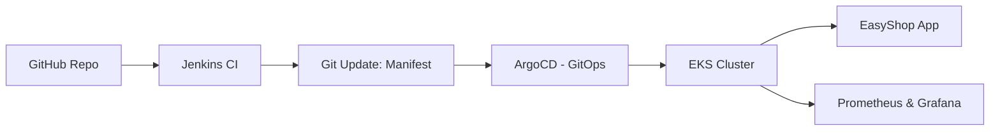

# 🛍️ EasyShop eCommerce 

EasyShop is a modern eCommerce platform built using the latest web technologies and deployed using a full DevOps workflow.

## ⚙️ DevOps Architecture (Production)



## 🚀 Getting Started

### Docker Setup Guide

This guide will help you run EasyShop using Docker containers. No local Node.js or MongoDB installation required!

### Prerequisites

- Install [Docker](https://docs.docker.com/get-docker/)
- Basic understanding of terminal/command line

### Step 1: Environment Setup

Create a `.env.local` file in the root directory with the following content:

```env
MONGODB_URI=mongodb://easyshop-mongodb:27017/easyshop
NEXTAUTH_URL=http://localhost:3000
NEXT_PUBLIC_API_URL=http://localhost:3000/api
NEXTAUTH_SECRET=your-nextauth-secret-key
JWT_SECRET=your-jwt-secret-key
```

Generate secure secrets:

```bash
# NEXTAUTH_SECRET
openssl rand -base64 32

# JWT_SECRET
openssl rand -hex 32
```

### Step 2: Running the Application

#### Option 1: Docker Compose (Recommended)

```bash
docker compose up -d
docker compose logs -f
docker compose down
```

#### Option 2: Manual Docker Commands

```bash
# Create network
docker network create easyshop-network

# MongoDB
docker run -d   --name easyshop-mongodb   --network easyshop-network   -p 27017:27017   -v mongodb_data:/data/db   mongo:latest

# Build App
docker build -t easyshop .

# Migration
docker build -t easyshop-migration -f scripts/Dockerfile.migration .
docker run --rm   --network easyshop-network   --env-file .env.local   easyshop-migration

# Run App
docker run -d   --name easyshop   --network easyshop-network   -p 3000:3000   --env-file .env.local   easyshop:latest
```

### Access the App

Go to: [http://localhost:3000](http://localhost:3000)

---

## 📦 Project Structure

```
easyshop/
├── src/
│   ├── app/
│   ├── components/
│   ├── lib/
│   │   ├── auth/
│   │   ├── db/
│   │   └── features/
│   ├── types/
│   └── styles/
├── public/
└── scripts/
```

## 🤝 Contributing

1. Fork the repository
2. Create your branch: `git checkout -b feature/amazing-feature`
3. Commit changes: `git commit -m 'Add amazing feature'`
4. Push to GitHub: `git push origin feature/amazing-feature`
5. Submit a Pull Request

## 📝 License

This project is licensed under the MIT License.

## 🙏 Acknowledgments

- Next.js
- Tailwind CSS
- MongoDB
- Redux Toolkit
- Radix UI

## 📫 Contact

Made with ❤️ by [@sahastra16](https://www.linkedin.com/in/sahastra/)

Project Link: [GitHub](https://github.com/sahastra16/tws-e-commerce-app)
